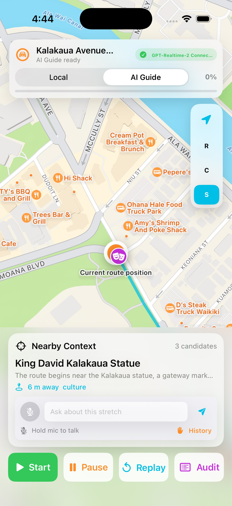

# Cruisin

Cruisin is a small iOS prototype for a natural voice guide while driving.

The idea came from my last trip to Vancouver. I kept passing buildings, neighborhoods, parks, restaurants, and random landmarks I was curious about, but there was no natural way to ask, "What is that?" or "Why does this area matter?" without stopping, searching, or staring at a screen.

When GPT-Realtime-2 came out, it felt like the perfect model for this: a voice guide that can keep the conversation moving, handle interruptions, reason over nearby context, and respond naturally while the drive keeps moving.

This demo replays a simulated Kalakaua Avenue / Waikiki Beach drive. It ranks nearby bundled facts, sends compact route context to OpenAI Realtime with `gpt-realtime-2`, and lets the user interrupt naturally with push-to-talk. If realtime access fails, the same route still works with a local AVFoundation voice fallback.



## What It Shows

- Native SwiftUI driving surface with MapKit route replay
- Nearby local context ranked by distance, relevance, source quality, and user preference
- OpenAI Realtime narration using `gpt-realtime-2`
- Push-to-talk interruption for questions or preferences
- Local fallback voice when API access is unavailable
- Bundled facts only; no live GPS, navigation, traffic, scraping, or backend

## Run It

Copy `.env.example` to `.env` and add an OpenAI API key:

```sh
cp .env.example .env
```

Build:

```sh
xcodebuild \
  -project Cruisin.xcodeproj \
  -scheme Cruisin \
  -configuration Debug \
  -derivedDataPath .derivedData \
  -destination 'platform=iOS Simulator,name=iPhone 17 Pro,OS=26.5' \
  build
```

Launch with realtime enabled:

```sh
set -a
source .env
set +a

APP_PATH="$PWD/.derivedData/Build/Products/Debug-iphonesimulator/Cruisin.app"
xcrun simctl install booted "$APP_PATH"
SIMCTL_CHILD_OPENAI_API_KEY="$OPENAI_API_KEY" \
SIMCTL_CHILD_OPENAI_REALTIME_API_KEY="${OPENAI_REALTIME_API_KEY:-$OPENAI_API_KEY}" \
  xcrun simctl launch --terminate-running-process booted com.avmillabs.cruisin
```

Run tests:

```sh
xcodebuild \
  -project Cruisin.xcodeproj \
  -scheme Cruisin \
  -configuration Debug \
  -derivedDataPath .derivedData \
  -destination 'platform=iOS Simulator,name=iPhone 17 Pro,OS=26.5' \
  test
```

## Demo Flow

1. Launch the app and select `AI Guide`.
2. Tap `Start` or `Replay`.
3. Let the guide speak about nearby context.
4. Hold the mic and ask something natural, like "What is this area known for?" or "Skip food and give me the history angle."
5. Release the mic and let the realtime guide answer.

## Submission Notes

Project name: Cruisin AI Guide Mode

Repo: https://github.com/jskoiz/cruisin

Models used: OpenAI Realtime with GPT-Realtime-2 (`gpt-realtime-2`)

Scope: simulated route replay only. This is not turn-by-turn navigation, not live traffic, not CarPlay, and not a driving safety product.
